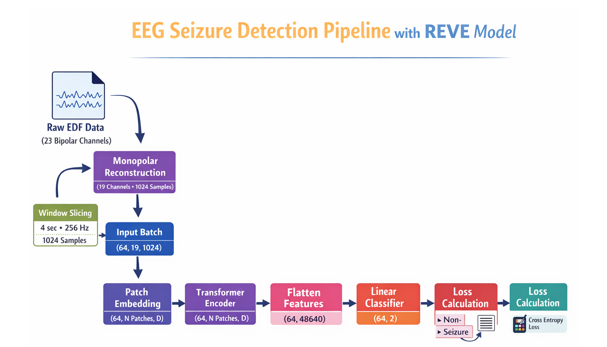

# REVE for EEG Seizure Detection

<p align="center">
  
</p>

## Overview

This project investigates whether REVE (Representation for EEG with Versatile Embeddings), a pretrained EEG foundation model, contains transferable seizure-related information.

The model was evaluated on the CHB-MIT Scalp EEG Dataset using a linear probing approach, where the pretrained REVE backbone was frozen and only a lightweight classifier was trained for seizure vs. non-seizure classification.

The project was implemented using Python, MNE, PyTorch, and Braindecode.

## Motivation

EEG recordings are highly heterogeneous across subjects, devices, and electrode configurations, making generalization difficult for traditional EEG models.

Recent EEG foundation models such as REVE aim to learn universal EEG representations through large-scale self-supervised pretraining.

The goal of this project was to investigate whether frozen REVE embeddings can transfer to a clinically relevant downstream task: seizure detection.

## Dataset

CHB-MIT Scalp EEG Database

- Pediatric epilepsy EEG recordings
- EDF format
- Seizure onset and offset annotations
- Downloaded from PhysioNet

For initial experiments:

- chb01
- chb02
- chb03

were used for development and testing.

## Pipeline

Raw EDF Files
↓
MNE Data Loading
↓
Seizure Annotation Extraction
↓
4-second EEG Windows (50% overlap)
↓
Bipolar → Monopolar Reconstruction
↓
Channel Normalization
↓
Pretrained REVE Backbone
↓
Frozen Feature Extraction
↓
Linear Classification Head
↓
Seizure / Non-Seizure Prediction

## Repository Structure

```text
REVE/
├── download_chbmit.py
├── make_windows.py
├── build_dataset_balanced.py
├── smoke_test_reve.py
├── train_linear_probe.py
├── save_test_predictions.py
├── plot_test_predictions.py
├── event_level_evaluation.py
├── channel_importance.py
└── README.md
```

## Scripts

| Script | Description |
|----------|----------|
| download_chbmit.py | Download CHB-MIT dataset |
| make_windows.py | Create seizure-labeled EEG windows |
| build_dataset_balanced.py | Build train/val/test datasets |
| smoke_test_reve.py | Verify REVE installation and forward pass |
| train_linear_probe.py | Train frozen REVE + linear classifier |
| save_test_predictions.py | Save test predictions |
| plot_test_predictions.py | Visualize seizure probabilities |
| event_level_evaluation.py | Event-level seizure detection metrics |
| channel_importance.py | Gradient-based channel importance |

## Results

Linear probing using a frozen pretrained REVE backbone achieved:

| Metric | Value |
|----------|----------|
| AUROC | 0.9549 |
| F1-score | 0.4094 |
| AUPRC | 0.3329 |
| Balanced Accuracy | 0.6662 |

These results suggest that pretrained REVE embeddings contain useful seizure-related information despite extreme class imbalance and subject variability.

## Installation

```bash
git clone https://github.com/zhenhad/EEG-Foundation-Models.git

cd EEG-Foundation-Models/REVE

pip install -r requirements.txt
```
---
## Technologies

- Python
- PyTorch
- Braindecode
- MNE-Python
- NumPy
- Pandas
- Scikit-learn
- Matplotlib

## Future Work

- Fine-tune the REVE backbone
- Scale experiments to the full CHB-MIT dataset
- Compare REVE with EEGPT
- Evaluate on TUH EEG Corpus
- Improve seizure localization and channel importance analysis

  ## References

REVE: Representation for EEG with Versatile Embeddings
NeurIPS 2025

## Author

Zhenous Hadi Jafari

PhD Student
Department of Bioengineering
University of Texas at Arlington

GitHub:[zhenhad](https://github.com/zhenhad)
